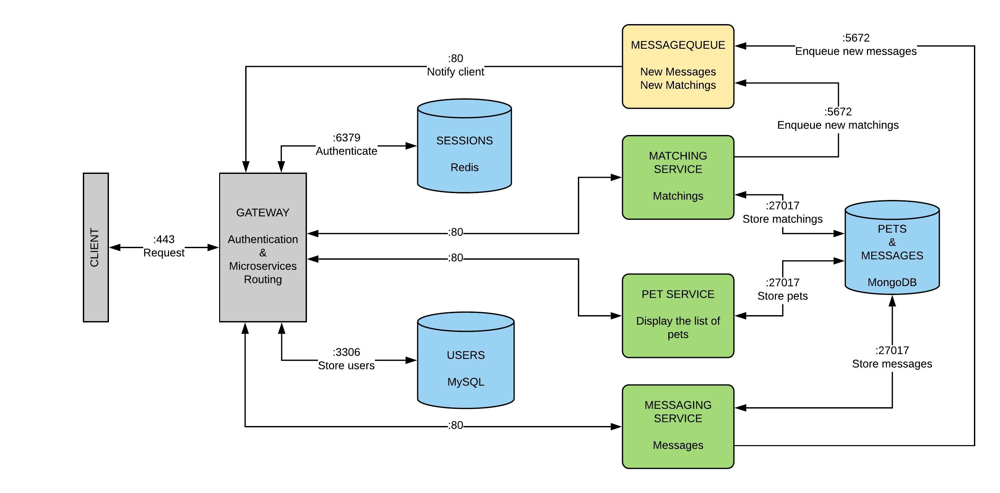

# Petinder

Petinder is a social search web application that allows pet owners to like or dislike other pets, and allows pet owners to chat if both parties liked each other’s pet in the application. The app will be used as a pet dating site.

## Why
These days, most apps are marketed as “Tinder for ____”: there’s a Tinder for jobs, a Tinder for Jews, and a Tinder for people who are literally two feet away from each other. But there is no Tinder for cats and dogs in the market just yet. The current practices for finding a mate for pets are usually through asking neighbors or friends if they own, or have seen a dog of the same breed that wants to mate. There are also some, but not very popular, websites like thedogmates.com which claims to offer a wide choice of available mates. Finding mates for pets, especially pets that are not dogs, by using the style of Tinder has not yet been developed. Our goal is to create a way for pet owners to find mates for their dogs to breed with as well as also to build a legitimate social network for animals and their humans.  Our small web application would be perfect for pet owners who want an easy, fun, yet serious way to find, not just a mate, but the perfect mate for their loving companion animals.

## What
Our model is of something similar to Tinder but tailored to pets and pet owners. Users are able to profile for their pet that features photos, videos, and their pet’s “habits”.  The application will then provide them with pictures of pets who are the same breed. The users could read more information about the pet, and those interested can then like it. Once a match has happened, the two pet owners could chat with each other more in-depth about their pets or even set up a date. 

## Architecture


## User Stories
Priority | User | Description
--- | --- | ---
P0 | Pet Owner | As a user, I want to see a list of pets that are the same breed as mine
P0 | Pet Owner | As a user, I want to upload a profile for my pet
P0 | Pet Owner | As a user, I want to communicate/chat with the other pet owner who is interested in my pet
P0 | Pet Owner | As a user, I want to like/choose a potential mate for my pet
P0 | Pet Owner | As a user, I want to be notified if someone else liked my pet and want to chat with me

## Client
A simple web application that showing a list of pets and chat messages

## Database Schema

### Users

```sql
create table if not exists users (
    id int not null auto_increment primary key,
    email varchar(128) not null unique,
    username varchar(255) not null unique,
    passhash binary(60) not null,
    firstname varchar(64) not null,
    lastname varchar(128) not null,
    photourl varchar(2083) not null 
);
```

### Sessions
Simple redis key-value store, associating session IDs with session stores, which include:

* Session start time
* User profile

### Pets
MongoDB pet storage. The pet model includes:

* `id` (ObjectID)
* `owner` (user)
* `name` (String)
* `gender` (String)
* `age` (Number)
* `breed` (String)
* `city` (String)
* `intro` (Automerge-compatible string)
* `likeList` ([ObjectID])

### Messages
MongoDB message storage. The message model includes:

* `id` (ObjectID)
* `channelID` (ObjectId)
* `body` (Automerge-compatible string) 
* `creator` (User)
* `editedAt` (datetime)
* `createdAt` (datetime)

### Channels
MongoDB channel storage. The channel model includes:

* `id` (ObjectID)
* `name` (String)
* `description` (String)
* `members` ([userID])
* `editedAt` (datetime)
* `createdAt` (datetime)

## API Reference

### POST /v1/users
Posts a new user using the JSON obejct in the request body. The Content-Type header must be application/json. The request body is a jsonobject with the new user's email, password, passwordConf, and displayName. To be a valid new user,password and passwordConf must match, email must not be taken by another user, and displayName must notbe empty. A copy of the created user is sent as a response.

* 415 Content-Type does not start with application/json
* 201 New user has been created
* 405 Any other HTTP Method
* 500 Internal server error

### GET /v1/users/:id
Gets a the user with the given id, or gets the currently logged in user if id is me. The user must be logged in to perform thisaction. A copy of the given user is sent as a response.

* 415 Content-Type does not start with application/json
* 200 Status OK
* 405 Any other HTTP Method
* 500 Internal server error

### PATCH /v1/users/:id
Updates the display name of the user with the given id, or the currently logged in user if id is me. The Content-Typeheader must be application/json.  The usermust be logged in to perform this action, and can only perform it on themselves. A copy of the updated user is sent as aresponse.

* 200: Successfully edited user.
* 400: The id parameter is not a valid user ID, or the provided updates are not valid.
* 401: The user is not logged in.
* 401: The user is attempting to edit a user other than themselves.
* 415: Content-Type not application/json .
* 500: Internal server error.

### POST /v1/sessions
Creates a new user session. Content-type must be application/json. Request body is a json obejct, that has email and password if a registered user is logged in. 

* 201: New session created
* 400: The request body is not valid.
* 401: The email/password given was invalid
* 415: Content-type is not application/json
* 500: Internal server error

### DELETE /v1/sessions/:id
Ends a user sesssion. The seesion id must be "mine"

* 200: Successfully ended session.
* 403: The user is attempting to end another user's session.
* 500: Internal server error.

### GET /v1/channels
Responds with the list of channels that the current user is allowed to see, encoded in a JSON array.

* 200: Status OK
* 401: no X-User header in the request

### POST /v1/channels
Creates a new channel using the channel model JSON in the request body.

* 201: New channel created
* 401: no X-User header in the request

### GET /v1/channels/:channelID
If this is a private channel and the current user is not a member, responds with a 403 (Forbidden) status code. Otherwise, responds with the most recent 100 messages posted to the specified channel, encoded as a JSON array of message model objects.

* 200: Status OK
* 403: The channel is private or the current user is not a member
* 401: no X-User header in the request

### POST /v1/channels/:channelID
If this is a private channel and the current user is not a member, responds with a 403 (Forbidden) status code. Otherwise, creates a new message in this channel using the JSON in the request body.

* 201: New message created
* 401: no X-User header in the request

### PATCH /v1/channels/:channelID
 If the current user isn't the creator of this channel, responds with the status code 403 (Forbidden). Otherwise, updates only the name and/or description using the JSON in the request body and respond with a copy of the newly-updated channel, encoded as a JSON object.

* 403: Current user isn't the creator of the channel
* 200: Status OK
* 401: no X-User header in the request

### DELETE /v1/channels/:channelID
If the current user isn't the creator of this channel, responds with the status code 403 (Forbidden). Otherwise, deletes the channel and all messages related to it. 

* 403: Current user isn't the creator of the channel
* 200: Status OK
* 401: no X-User header in the request

### PATCH /v1/messages/:messageID
If the current user isn't the creator of this message, responds with the status code 403 (Forbidden). Otherwise, updates the message body property using the JSON in the request body, and responds with a copy of the newly-updated message, encoded as a JSON object.

* 403: Current user isn't the creator of the message
* 200: Status OK
* 401: no X-User header in the request

### DELETE /v1/messages/:messageID
 If the current user isn't the creator of this message, responds with the status code 403 (Forbidden). Otherwise, deletes the message and respond with a the plain text message indicating that the delete was successful.

* 403: Current user isn't the creator of the message
* 200: Status OK
* 401: no X-User header in the request

### GET /v1/pet
Gets information of the pet that is owned by the current user encoded in the "X-User" header

* 500: Internal server error.
* 200: Status OK
* 401: no X-User header in the request

### POST /v1/pet
Creates a new pet profile for the current user using the pet information encoded as a JSON object in the request body. Responds with a copy of the newly-created pet

* 500: Internal server error.
* 201: New pet created
* 401: no X-User header in the request

### PATCH /v1/pet
Updates information of the pet owned by the current user using the pet information encoded as a JSON object in the request body. Responds with a copy of the newly-updated pet

* 500: Internal server error.
* 200: Status OK
* 401: no X-User header in the request

### DELETE /v1/pet
Deletes current user's pet profile

* 500: Internal server error.
* 200: Status OK
* 401: no X-User header in the request

### GET /v1/matching
Gets a list of pets for matching

* 500: Internal server error.
* 200: Status OK
* 401: no X-User header in the request

### POST /v1/matching/:petID
Likes a pet with the associated petID, stores the petID in the like list of the pet that owned by the current user

* 500: Internal server error.
* 200: Status OK
* 401: no X-User header in the request

### DELETE /v1/matching/:petID
Deletes the pet with the associated petID from the like list of the pet that owned by the current user

* 500: Internal server error.
* 200: Status OK
* 401: no X-User header in the request